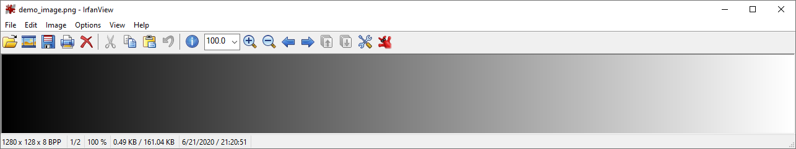
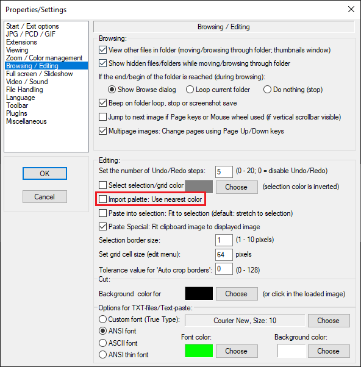
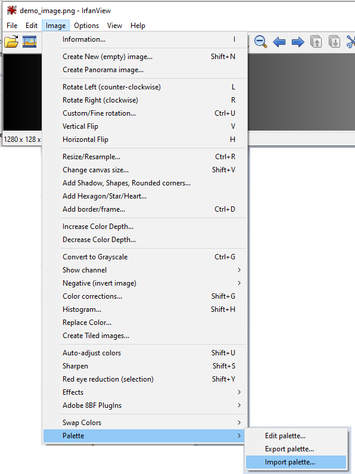
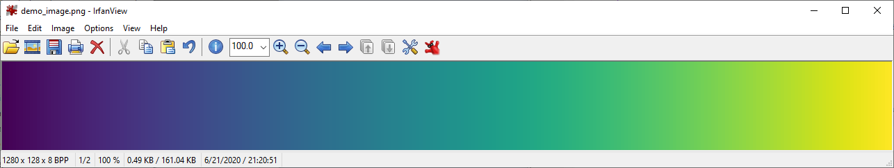

# Irfanview color palettes

This repository contains 78 of matplotlib colormaps for use with irfanview image viewer. 
When irfanview displays a greyscale image, there is an option (<kbd>Image</kbd> -> <kbd>Palette</kbd> -> <kbd>Import palette</kbd>...) to display the image using a color palette (or color map in matplotlib's vocabulary).

## Example usage

I have generated a sample greyscale image on which to demo the irfanview color palette function.
It is a linear greyscale gradient from 0 on the left to 255 on the right.

First, make sure that the option to "use nearest color" when importing a color palette is turned off.
Find that option under <kbd>Options</kbd> -> <kbd>Properties/Settings</kbd>

Next, go to (<kbd>Image</kbd> -> <kbd>Palette</kbd> -> <kbd>Import palette</kbd>...)

Select viridis.pal (or any other color palette). This should be the result:

